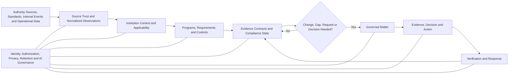

# ClearSight GRC

> **The direct, AI-native continuous compliance and risk operating system for banks.**  
> Know what applies. Keep proof current. Handle what changed. Respond with confidence.

ClearSight is being designed for banks whose compliance, risk, security, privacy, resilience, audit, legal, business, and executive teams need a simpler and more useful alternative to form-heavy GRC suites and disconnected spreadsheets.

The product goal is:

> **Help every stakeholder understand what the institution must do, how it is currently being satisfied, what evidence proves it, what has changed or become uncertain, who must act, and whether the required outcome was achieved.**

ClearSight remains a comprehensive modern GRC platform. The difference is that users do not operate its internal architecture. They work through familiar **Programs**, **Matters**, focused evidence requests, decisions, and outcomes.

A DPO should be able to run the institution’s NDPA programme without rebuilding ROPA, DPIA, breach, vendor, consent, and annual filing status from separate workbooks. A channel owner should see the exact POS or ATM exposure requiring action. A compliance officer should turn a new CBN circular into approved obligations, controls, owners, and evidence requirements. An authorized legal or AML team should handle an EFCC-style request through a protected, traceable case instead of email and ad hoc spreadsheets.

## Current status

This repository is at the **product-definition and architecture stage**. Capabilities described here are product requirements and intended behavior, not claims of completed implementation.

Start with:

- [`docs/product/continuous-compliance-operating-model.md`](docs/product/continuous-compliance-operating-model.md) — the Programs and Matters model that replaces disconnected registers.
- [`docs/product/operating-model.md`](docs/product/operating-model.md) — canonical bank scopes, observations, claims, evidence, decisions, and verification.
- [`docs/product/regulatory-and-enforcement-intelligence.md`](docs/product/regulatory-and-enforcement-intelligence.md) — regulatory change, supervisory findings, and protected authority cases.
- [`docs/product/experience-principles.md`](docs/product/experience-principles.md) — product and visual interaction standard.
- [`docs/implementation-plan.md`](docs/implementation-plan.md) — phased delivery plan.
- [`docs/quality/acceptance-tests.md`](docs/quality/acceptance-tests.md) — product, security, evidence, visual, and end-to-end requirements.
- [`AGENTS.md`](AGENTS.md) — mandatory implementation and non-regression rules.

---

# Why ClearSight

Most banks do not lack registers. They have too many of them.

The same institutional reality is often copied into:

- compliance registers;
- IT and operational risk registers;
- exception trackers;
- RCSA workbooks;
- KRI submissions;
- BIA registers;
- vendor assessments;
- privacy checklists;
- policy and certification trackers;
- incident and loss logs;
- annual workplans;
- regulatory response files;
- management dashboards.

Ownership is transferred through comments and email. Evidence is repeatedly requested. Reports are manually assembled. A completed task can appear “closed” even when the intended result has not been observed.

ClearSight does not merely turn these spreadsheets into web forms.

It creates one governed operating layer in which:

```text
one source is captured once
→ one requirement, control, asset, vendor, event, case, action, or decision is maintained once
→ many authorized views are generated from the same records
```

---

# The two things users operate

## 1. Programs — continuing obligations

A **Program** is a stable, long-lived body of requirements, controls, evidence, reviews, exceptions, and reporting obligations.

Examples:

- NDPA and NDPC compliance;
- AML/CFT;
- CBN cybersecurity and technology risk;
- PCI DSS;
- ISO 27001 and ISO 22301;
- operational resilience;
- third-party assurance;
- RCSA;
- policy lifecycle;
- regulatory returns;
- annual IT risk and control reviews.

A Program answers:

- What requirements apply?
- Which entities, products, services, systems, branches, vendors, customers, or data are in scope?
- How is each requirement intended to be satisfied?
- Who owns and independently reviews it?
- What evidence is required?
- Is the evidence current, sufficient, and consistent?
- Which exceptions or gaps are active?
- What filing, review, test, or decision is due next?

## 2. Matters — work created by change or exception

A **Matter** is a bounded occurrence requiring assessment, evidence, decision, action, response, or verification.

Matter types include:

- regulatory change;
- supervisory finding;
- enforcement or authority request;
- risk situation;
- control gap;
- audit finding;
- exception or waiver;
- incident;
- operational loss;
- data breach;
- vendor deficiency;
- customer or conduct concern;
- overdue obligation;
- failed verification;
- evidence contradiction;
- KRI threshold breach.

A Matter answers:

- What happened or changed?
- Why does it matter?
- What is affected?
- What is known, missing, stale, or contradictory?
- Which Program, requirement, control, service, customer, account, asset, or vendor is involved?
- Who must decide or respond?
- What actions are underway?
- How will closure or response be verified?

This distinction keeps ongoing compliance calm while making unusual work direct and accountable.

---

# One compliance chain

Every material compliance position should be traceable through one chain:

```text
Authority Source or Standard
→ Requirement
→ Applicability
→ Institutional Requirement
→ Control Objective
→ Control Implementation
→ Evidence Contract
→ Current Observations
→ Compliance State
→ Matter, Exception, or Assurance Conclusion
```

## Authority source

The original law, circular, regulation, guideline, standard, licence condition, contract, court instrument, or approved internal interpretation.

A manually authored spreadsheet row is not automatically an authoritative regulatory source. It is a working record that must be reconciled to the original source before becoming an approved obligation.

## Requirement and applicability

A Requirement describes what an actor must, must not, may, or is expected to do.

Applicability determines where it applies—for example by legal entity, licence, jurisdiction, product, channel, processing activity, customer population, vendor relationship, system, threshold, or effective period.

AI may propose interpretation and applicability. Authorized compliance or legal reviewers approve material conclusions.

## Control objective and implementation

A control objective defines the outcome that must be achieved.

A control implementation is the actual process, policy, system rule, approval gate, review, monitoring mechanism, or operating practice used in a defined scope.

One objective can have different implementations across legal entities, channels, systems, branches, or vendors.

## Evidence contract

An Evidence Contract defines what continuously proves the requirement and control are satisfied:

- exact claims;
- required population and period;
- acceptable sources;
- source authority and limitations;
- freshness;
- coverage;
- independence;
- contradiction rules;
- reviewer authority;
- refresh schedule or trigger;
- escalation and failure behavior.

## Compliance state

ClearSight keeps separate dimensions visible:

- interpretation;
- applicability;
- control design;
- implementation;
- evidence sufficiency;
- operating effectiveness;
- exceptions;
- assurance;
- deadline or filing status;
- source and data quality.

The product may show a concise state such as **current**, **at risk**, **gap identified**, **evidence insufficient**, **implementation pending**, **overdue**, **under review**, **not applicable**, or **unknown**. It must not hide the underlying dimensions behind an unexplained percentage.

---

# Continuous compliance, not periodic reconstruction

Continuous compliance does not mean ClearSight autonomously guarantees legal compliance.

It means the institution continuously maintains an evidence-backed and reviewable position, instead of rebuilding that position only before an audit, certification, committee meeting, or regulatory filing.

A Program responds to four types of trigger.

## Calendar triggers

Annual filings, monthly returns, quarterly reports, periodic access reviews, policy reviews, certificate expiry, DR tests, vendor reassessments, and scheduled assurance work.

## Change triggers

New regulation, new product, project, process change, vendor, system, cloud deployment, branch, channel, customer population, data use, or control configuration.

## Event triggers

Incident, breach, complaint concentration, control failure, KRI threshold breach, vendor expiry, source outage, law-enforcement request, failed test, or operational loss.

## Evidence triggers

Expired observations, changed populations, source contradiction, stale integrations, insufficient sampling, challenged assurance conclusions, or failed verification periods.

People are contacted because a meaningful fact, decision, or proof is missing—not merely because a broad recurring campaign started.

---

# How cumbersome legacy workflows become easier

| Legacy workflow | ClearSight representation | Result |
|---|---|---|
| Compliance register | Program Requirements and Compliance State view | Original source, applicability, control, proof, deadlines, and amendments remain connected |
| IT or operational risk register | Risk Matters linked to assets, services, controls, decisions, and evidence | Owners, assets, controls, and actions are not repeatedly re-entered |
| Exception register | Exception Matter with authority, conditions, expiry, and verification | Redirect, approval, challenge, and closure are explicit rather than buried in comments |
| Annual workplan | Scheduled Review Activities | Reviews reuse existing assets, vendors, requirements, controls, and evidence |
| RCSA | Periodic or trigger-based control review | Known facts are prefilled and owners answer only unresolved judgments |
| KRI workbook | Indicators derived from observations and Matters | Every metric has scope, period, denominator, and drill-down lineage |
| BIA register | Critical-service and dependency context | RTO, RPO, applications, vendors, and resources support resilience, risk, incident, and regulatory work |
| Loss register | Loss Event linked to incident, cause, recovery, control failure, and remediation | Recovery and recurrence no longer require manual reconciliation |
| Vendor register | Third-party profile, service relationship, requirements, evidence, findings, and Matters | Certificates and assessments can be reused safely across affected services |
| Policy tracker | Governed policy lifecycle mapped to Requirements and Controls | A policy change shows which obligations and implementations are affected |
| Certification tracker | Program milestone and Evidence Contract | Expiry, gap assessment, remediation, testing, and recertification stay connected |
| Dashboard pack | Derived role-specific view | Reports come from governed current records rather than manually copied summaries |
| Authority-request KRI | Aggregate over protected Authority Request Cases | Counts remain traceable without exposing protected subjects |

A register remains a useful import, export, table, or report. It is no longer a separate truth system.

---

# Example: continuous NDPA and NDPC compliance

A privacy Program should continuously maintain the institution’s position across:

- registration and classification;
- DPO governance;
- annual compliance audit and filing;
- ROPA;
- lawful basis and consent;
- DPIA;
- security controls;
- breach management;
- data-subject rights;
- retention and deletion;
- vendor and processor governance;
- cross-border transfers;
- digital-channel notices and cookies;
- emerging technology and automated decisions.

## ROPA becomes a living inventory

ClearSight preloads processing activities from application catalogues, projects, changes, vendors, data inventories, customer journeys, privacy notices, and prior ROPA records.

Department owners are asked only for unresolved fields such as purpose, lawful basis, data categories, recipients, retention, transfers, or data-subject categories.

A changed application, vendor, dataset, purpose, or jurisdiction reopens only the affected processing activity—not the entire annual questionnaire.

## DPIA becomes an event-driven workflow

```text
Project, product, process change, vendor, AI system, or sensitive-data use
→ known context prefilled
→ focused screening
→ DPO decision on full DPIA
→ assessment and remediation where required
→ approval condition before go-live
→ post-deployment verification
```

The privacy decision remains linked to the project or change rather than copied into a separate register.

## Breach compliance becomes a timed Matter

A suspected personal-data breach creates a protected Matter with awareness time, affected systems and data, data-subject population, reportability assessment, deadline clock, customer communication decision, evidence, response package, remediation, and verification.

Detection, awareness, reportability decision, notification, acknowledgement, and closure remain distinct.

## Annual filing is prepared continuously

Throughout the year, ClearSight accumulates approved evidence, DPIAs, incidents, exceptions, remediation, and assurance results.

The filing workspace shows what is ready, missing, stale, disputed, excluded, reviewed, and signed—without a year-end scramble to reconstruct evidence.

## Vendor privacy review reuses third-party context

Vendor onboarding and renewal can trigger privacy review using the same vendor, service, contract, security evidence, processing role, data location, and owner already used by technology, operational, and resilience teams.

---

# Example: a new CBN circular

A new circular should not become one generic row marked “in progress.”

ClearSight should:

```text
capture and verify the official source
→ identify exact provisions and document status
→ extract candidate Requirements
→ compare with prior versions and related guidance
→ route interpretation and applicability review
→ identify affected entities, channels, systems, vendors, policies, and controls
→ show existing coverage and gaps
→ create approved implementation Matters and actions
→ define Evidence Contracts and tests
→ monitor readiness through implementation and operating evidence
```

An approved new Requirement becomes part of the relevant continuing Program. The implementation project may close, but the Requirement and its Evidence Contract continue.

---

# Example: EFCC or other external authority request

An enforcement or information request is a protected **Authority Request Case**, not a general compliance obligation.

ClearSight records:

- authentic source and issuing authority;
- legal instrument and review state;
- subjects, accounts, transactions, documents, devices, addresses, or periods;
- permitted disclosure and action scope;
- deadlines;
- KYC, address, records, AML, fraud, branch, legal, or technology tasks;
- evidence collected and excluded;
- decisions and approvals;
- response package;
- signatory, transmission, and acknowledgement;
- retention and legal hold.

The system may trigger a KYC refresh, address verification, records collection, or internal suspicious-activity assessment where policy requires it.

An authority request must not automatically establish wrongdoing, create suspicion, authorize an account restriction, or file an external report without the required institutional decision.

Aggregate authority-request KRIs are derived from the protected case population, not maintained as disconnected monthly counts.

---

# Flexible capture and progressive integration

ClearSight must become useful before a bank completes a major integration programme.

All capture methods produce normalized, source-preserving observations.

## Level 0 — Structured capture

Contextual forms, controlled dropdowns, photographs, scans, documents, spreadsheets, and mobile capture.

## Level 1 — Managed recurring imports

Approved Excel or CSV sources, SFTP, database exports, scheduled refresh, and reconciliation reports.

## Level 2 — API synchronization

IAM, HR, ITSM, asset catalogues, vendor systems, document repositories, complaints, projects, incidents, privacy, and core customer systems.

## Level 3 — Events and telemetry

Switch events, service monitoring, identity changes, settlement variance, security telemetry, control changes, vendor status, incidents, and customer-impact signals.

Each Source Profile states what the source is and is not authoritative for, its scope, freshness, identifiers, health, mapping version, and known limitations.

Uploading a spreadsheet or connecting an API does not automatically make every value authoritative.

---

# Product experience

ClearSight exposes five primary surfaces.

## Today

A role-specific attention brief showing only:

- Programs at risk or approaching deadlines;
- new or changed authority communications;
- Matters requiring a decision or response;
- material evidence gaps;
- overdue actions;
- failed verification;
- significant source degradation;
- important changes safely automated.

## Programs

Stable workspaces for NDPA, AML/CFT, CBN cybersecurity, PCI DSS, ISO, resilience, RCSA, vendor assurance, regulatory returns, and other ongoing responsibilities.

A Program shows requirements, applicability, controls, evidence, active Matters, exceptions, reviews, filings, changes, and source-to-state lineage.

## Work

The user’s queue and workspace for Matters, cases, findings, exceptions, incidents, actions, reviews, approvals, and evidence requests.

Each item uses familiar banking language and presents one clear next action.

## Explore

Authorized investigation across requirements, policies, controls, services, channels, branches, assets, customers, vendors, evidence, Matters, decisions, incidents, losses, and history.

## Configure

Restricted configuration for institution structure, sources, Programs, jurisdiction and channel packs, evidence contracts, thresholds, authority, retention, access, and automation policy.

## Respond and Capture

Branches, control owners, vendors, customers, and protected reporters receive lightweight contextual journeys rather than the full application shell.

They see why information is needed, what is already known, the exact unresolved question, acceptable proof, sensitivity, deadline, and answer, redirect, challenge, or conflict options.

---

# AI-first without AI theatre

AI acts as a governed compiler and assistant across the operating model.

It may:

- classify regulatory, supervisory, and enforcement documents;
- extract candidate requirements, directives, dates, thresholds, and subjects;
- compare versions;
- propose applicability, controls, owners, and evidence mappings;
- interpret approved spreadsheet and media inputs;
- identify duplicate or contradictory records;
- draft focused evidence requests;
- summarize Programs and Matters;
- draft implementation plans, test procedures, and response packages;
- propose verification criteria.

AI must not silently:

- publish final legal interpretation or applicability;
- mark a material Requirement compliant;
- accept risk;
- close a major finding or Matter;
- file a regulatory, suspicious, or external report;
- restrict an account;
- disclose protected information;
- represent the institution externally.

Material AI output requires source lineage, structured validation, authorization, confidence and abstention behavior, appropriate human review, and immutable audit.

The interface should feel intelligent because it preloads context, reduces questions, reconciles evidence, and presents direct work—not because every screen contains a chat box.

---

# Bank-first GRC coverage

The Programs and Matters model supports:

- regulatory obligations and change;
- compliance calendars and filings;
- policies, controls, testing, and assurance;
- enterprise, operational, cyber, technology, conduct, and model risk;
- RCSA, KRI, BIA, resilience, incidents, losses, and recovery;
- third-party and concentration risk;
- privacy, DPIA, ROPA, consent, breach, and data-subject rights;
- findings, exceptions, remediation, and verification;
- supervisory examinations and regulatory responses;
- protected enforcement and authority cases;
- audit, board, committee, and regulator-ready reporting.

ClearSight integrates with specialist fraud, AML, transaction monitoring, SIEM, SOAR, EDR, IAM, vulnerability, complaint, case-management, ITSM, HR, ERP, procurement, CRM, privacy, and core banking systems rather than replacing them.

---

# Technical shape



Initial architecture:

```text
Modular core
├── institution scopes and typed relationships
├── authority sources, Requirements and applicability
├── Programs, controls and Evidence Contracts
├── observations, conclusions and compliance state
├── Matters, cases, findings, exceptions and incidents
├── decisions, actions, response packages and verification
├── source registry, policy, authority and audit
├── versioned object storage
├── durable workflow and transactional outbox
├── authorization-aware search and projections
├── governed AI gateway
└── replaceable integration adapters
```

The first release does not require an institution-wide graph database, autonomous agent platform, large microservice estate, or perfect enterprise integrations.

---

# Initial product wedge

The strongest first pilot should prove three connected journeys.

## 1. Continuous compliance Program

Use a bounded NDPA, CBN cybersecurity, PCI DSS, or similar Program to prove:

- requirement and source import;
- applicability;
- control and evidence mapping;
- spreadsheet and API observations;
- targeted evidence requests;
- current compliance state;
- filing or review readiness;
- exception handling.

## 2. Regulatory change

Use one recent CBN circular to prove:

- official-source ingestion;
- provision extraction;
- human-approved interpretation;
- impact mapping;
- implementation Matters;
- evidence and testing;
- continuing compliance after implementation.

## 3. Authority or finding Matter

Use one protected authority request or one existing IT/vendor finding to prove:

- protected intake or legacy import;
- structured ownership and authority;
- evidence collection;
- decision and response;
- verification before closure;
- derived KRI, dashboard, and committee reporting.

This pilot demonstrates the core promise:

> **One source or event flows into the correct Program, Matter, action, evidence, response, and reporting views without being manually re-entered across spreadsheets.**

---

# Success measures

## Continuous compliance

- requirements with approved source lineage;
- time from publication to applicability decision;
- requirements with current sufficient evidence;
- stale, unsupported, or contradictory compliance positions;
- evidence reused instead of recollected;
- time spent preparing filings, audits, and examinations;
- Programs maintained without broad recurring questionnaires.

## Legacy workflow reduction

- spreadsheets retired or converted into governed views;
- duplicate records eliminated;
- manual reconciliations removed;
- email and comment-based ownership transfers replaced;
- manual report assembly hours removed;
- triggered work generated automatically;
- register views generated from shared objects.

## Matter handling

- time from trigger to accountable owner;
- overdue regulatory and authority responses;
- expired exceptions;
- findings closed without verified outcome;
- response packages returned for missing evidence;
- repeat incidents, losses, complaints, and findings.

## Trust

- source and provision coverage;
- unsupported interpretations;
- unresolved applicability;
- source freshness and mapping quality;
- unauthorized actions prevented;
- protected-case access violations;
- point-in-time reconstruction time;
- independent assurance challenges and overrides.

---

# Non-goals

ClearSight is not:

- a prettier spreadsheet repository;
- a generic form builder;
- a collection of disconnected GRC modules;
- a single-framework checklist;
- a dashboard layer over inconsistent source data;
- a full fraud, AML, transaction-monitoring, complaints, or investigation platform;
- a core banking system or payment switch;
- an autonomous compliance, legal, risk, or enforcement officer;
- an opaque AI scoring product;
- a mandatory graph canvas;
- a chatbot wrapper around registers.

---

# Product invariants

1. **Programs for continuing obligations; Matters for dynamic work.**
2. **One authoritative object, many role-specific views.**
3. **Original source before register summary.**
4. **Applicability before implementation.**
5. **Control implementation before compliance claim.**
6. **Current evidence before status.**
7. **Triggers and exceptions before blanket reminders.**
8. **Existing information before human requests.**
9. **Structured ownership before comment-based routing.**
10. **Aggregate metrics must drill down to governed records.**
11. **Human authority before material or external action.**
12. **Verification before closure.**
13. **AI compiles and drafts; authorized humans judge.**
14. **History is superseded, never silently rewritten.**
15. **Protected reporting and authority cases remain need-to-know.**
16. **The interface exposes work, not internal architecture.**

---

# Closing vision

A mature ClearSight deployment should allow any authorized stakeholder to ask:

> “What requirements apply to this part of the bank, how are they being satisfied, what current evidence proves it, what has changed or become uncertain, what work needs attention, and can we defensibly show the complete history?”

The answer should take seconds to understand at executive level, remain traceable to original authority and evidence, adapt to the bank’s size and integration maturity, and require the minimum reasonable effort from everyone involved.

**That is the standard for a modern, direct, continuously compliant bank GRC operating system.**
