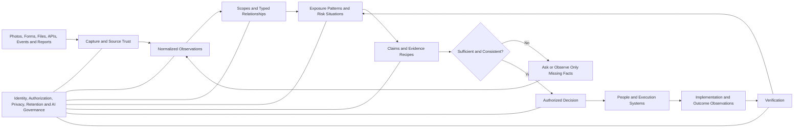

# ClearSight GRC

> **The direct, AI-native risk and governance operating system for banks.**  
> Understand the situation. Ask only what is missing. Decide clearly. Verify the outcome.

ClearSight is being designed for banks and other highly regulated institutions whose CROs, CCOs, CISOs, business owners, control owners, assurance teams, and boards need a more useful way to understand and handle risk than traditional form-heavy GRC systems provide.

The product goal is:

> **Enable each stakeholder to understand the risk situation relevant to them, provide or inspect the minimum necessary evidence, make an authorized and evidence-grounded decision, and verify whether the defined outcome was achieved.**

ClearSight remains a comprehensive modern GRC platform. The difference is that users should not have to operate its underlying architecture. Risks, controls, obligations, evidence, incidents, assets, vendors, decisions, actions, and assurance records are connected behind a small number of direct, role-appropriate workflows.

A branch manager should see the specific ATM or operational facts requiring confirmation—not a control framework. A channel owner should see the POS exposure, affected merchants, evidence gaps, and decision required—not disconnected dashboards. A CRO or CISO should see only material situations, uncertainty, options, authority, and outcome status.

## Current status

This repository is currently at the **product-definition and architecture stage**. Capabilities described here are product requirements and intended behavior, not claims of completed implementation.

Foundational documents:

- [`AGENTS.md`](AGENTS.md) — mandatory implementation and non-regression rules.
- [`docs/implementation-plan.md`](docs/implementation-plan.md) — phased implementation plan and acceptance gates.
- [`docs/product/differentiation.md`](docs/product/differentiation.md) — product moat and boundaries.
- [`docs/product/experience-principles.md`](docs/product/experience-principles.md) — visual and interaction standard.
- [`docs/architecture/living-evidence-fabric.md`](docs/architecture/living-evidence-fabric.md) — claim-centric evidence architecture.
- [`docs/architecture/risk-graph-and-decision-engine.md`](docs/architecture/risk-graph-and-decision-engine.md) — institutional relationships, materiality, and decisions.
- [`docs/architecture/governed-ai-operators.md`](docs/architecture/governed-ai-operators.md) — constrained AI capabilities and human authority.
- [`docs/quality/acceptance-tests.md`](docs/quality/acceptance-tests.md) — product, security, visual, and end-to-end requirements.

---

# Product thesis

## Present situations, not modules

A material banking risk is rarely contained in one register row.

An ATM availability problem may involve device inventory, branch location, switch telemetry, power, connectivity, cash replenishment, maintenance vendors, complaints, fraud indicators, impact tolerance, open findings, and prior decisions. A POS settlement problem may involve merchants, terminals, processors, transaction files, reconciliation breaks, reversals, fraud, complaints, and contractual obligations.

Traditional GRC products often store those facts in separate modules and ask users to reconstruct the actual situation. ClearSight connects them, but presents the result as a direct, bounded **risk situation**:

- what is affected;
- what changed;
- how the institution may be exposed;
- what is known and uncertain;
- what proof is missing;
- who must decide;
- what should happen next;
- and how the response will be verified.

## Use familiar banking language first

ClearSight should speak first in terms such as:

- ATM channel;
- POS acquiring;
- mobile banking;
- branch cash operations;
- payments resilience;
- privileged access;
- merchant onboarding;
- customer complaints;
- settlement and reconciliation;
- vendor concentration.

Framework references, control identifiers, obligation mappings, evidence policies, graph relationships, and AI lineage remain available through progressive disclosure, but they should not dominate routine work.

## Assemble evidence around exact claims

A control is not effective because an owner selected “effective.” A remediation is not successful because a ticket was completed. A requirement is not satisfied because a document was uploaded.

ClearSight asks what must be established, for which scope and period, then finds or collects the minimum sufficient proof.

Example:

> Every active ATM in the Lagos region is uniquely identified, assigned to an approved location, communicating with the switch, and reconciled with the current asset inventory as of the review date.

The system can determine which facts already exist, which conflict, and which branches or systems need to provide missing information.

## AI reduces assembly work, not accountability

AI may interpret photographs, extract spreadsheets and documents, reconcile identifiers, identify contradictions, draft questions, summarize situations, explain relationships, and recommend options.

Policy and deterministic domain logic still determine:

- what data may be accessed;
- what evidence is acceptable;
- whether a threshold is breached;
- who has authority;
- whether an action requires approval;
- and whether closure conditions were met.

AI should make ClearSight feel easier because users perform less navigation, data entry, and evidence assembly—not because every screen contains a chatbot.

---

# The simplified operating model

ClearSight is built around six universal objects. They remain consistent across regional, national, and multinational banks and across ATM, POS, mobile banking, internet banking, branch operations, cards, agency banking, and payments.

## 1. Scope

The bounded part of the institution being governed:

- institution or legal entity;
- country, region, or jurisdiction;
- service or channel;
- branch, location, process, or operating unit;
- customer or merchant segment;
- vendor relationship;
- system;
- asset population.

Examples include the Lagos retail ATM network, POS terminals operated through one processor, mobile banking for retail customers, or privileged access to Treasury Operations.

## 2. Exposure pattern

A reusable description of how a service, process, asset, party, or obligation can fail or cause harm.

ClearSight begins with controlled exposure families instead of thousands of disconnected risk statements:

1. **Availability and resilience** — service cannot operate or recover within tolerance.
2. **Asset and inventory integrity** — devices, systems, accounts, facilities, or records are incomplete, missing, duplicated, or wrongly assigned.
3. **Identity and access** — an unauthorized person, account, device, merchant, vendor, or service can participate.
4. **Transaction integrity** — transactions are unauthorized, altered, incomplete, duplicated, or incorrectly processed.
5. **Reconciliation and settlement** — operational and financial records do not agree within the approved tolerance and period.
6. **Fraud and abuse** — the channel or process can be manipulated for unauthorized benefit.
7. **Data and privacy** — customer or institutional data is exposed, misused, incorrectly retained, or inadequately protected.
8. **Customer and conduct harm** — customers experience unfair treatment, unauthorized charges, exclusion, delayed redress, or recurring control failures.
9. **Third-party and concentration dependency** — a service depends excessively on a provider, location, network, technology, or fourth party.
10. **Change and configuration integrity** — changes are unauthorized, untested, misconfigured, or inadequately monitored.
11. **Physical and environmental integrity** — assets, facilities, cash, power, access, location, or environmental conditions are not adequately controlled.

A channel pack combines relevant patterns with channel-specific claims, terminology, evidence recipes, thresholds, and workflows.

## 3. Risk situation

A current, bounded instance of exposure requiring monitoring, evidence, action, or decision.

Examples:

> Thirty-one active ATM records do not have a verified device, location, and branch relationship. Twelve have also stopped producing switch heartbeats.

> POS settlement files contain duplicate terminal identifiers and cannot be fully reconciled to switch transactions for the current period.

> Four privileged Treasury accounts have no current business-need evidence, and HR indicates one account holder transferred departments.

A situation includes affected scope, exposure patterns, observations, institutional context, materiality, evidence state, uncertainty, owner, authority, action, and verification status.

## 4. Claim and evidence recipe

A **claim** is the exact statement that must be supported, contradicted, qualified, or left unresolved.

An **evidence recipe** defines:

- facts required;
- acceptable source types;
- source authority and independence;
- required population and period;
- freshness limits;
- allowed capture methods;
- contradiction rules;
- minimum sufficiency policy;
- approval requirements.

Example:

```yaml
claim_type: asset_presence_and_assignment
subject_type: atm
required_facts:
  - device_serial
  - terminal_id
  - assigned_branch
  - physical_location
  - responsible_owner
  - operational_state
acceptable_sources:
  asset_inventory: primary
  switch_telemetry: primary
  field_photo: corroborating
  branch_confirmation: assertion
minimum_policy:
  - asset_inventory
  - switch_telemetry
  - one_of:
      - current_field_photo
      - independent_inspection
```

The same recipe can work when one bank has real-time APIs and another begins with controlled spreadsheets and staff capture.

## 5. Observation

An observation is a normalized fact, assertion, measurement, or extracted value produced by any approved capture method.

Every observation records:

- subject and property;
- value;
- source identity;
- capture method;
- effective and capture time;
- scope;
- provenance;
- confidence or review state;
- sensitivity;
- original artifact or source reference.

A photograph, spreadsheet row, form response, dropdown selection, database record, API event, telemetry value, customer report, or staff attestation can enter through different channels while remaining comparable and traceable.

## 6. Decision and verification

A material decision records the situation, evidence used and excluded, contradictions, options, assumptions, selected action, rationale, authority, conditions, review triggers, expiry, and verification method.

A verification contract defines:

- expected outcome;
- baseline;
- measurement source;
- population or scope;
- success and failure thresholds;
- observation period;
- acceptance authority;
- failure response.

ClearSight verifies whether the defined outcome criteria were met. It does not overstate that one action conclusively caused every later change in risk.

---

# One operating loop

```text
Observe
→ identify a risk situation
→ establish what must be true
→ find or request only missing proof
→ decide within authority
→ act
→ verify the defined outcome
→ update the situation and institutional memory
```

Signal ingestion, institutional relationships, materiality, evidence evaluation, decisions, workflows, and AI governance support this loop. They should not become the user’s navigation model.

---

# One product across different banks

ClearSight uses one adaptable hierarchy:

```text
Institution
└── Legal entity
    └── Country, jurisdiction, or region
        └── Business service or channel
            └── Location, branch, process, or operating unit
                └── Asset, system, vendor, segment, or accountable role
```

A regional bank may use:

```text
Bank → Channel → Branch → Asset
```

A multinational group may use:

```text
Group → Legal entity → Country → Channel → Service → Location → Asset
```

Complexity is introduced through configuration and scope, not custom product forks.

## Configuration layers

- **Base banking model:** universal services, channels, branches, assets, transactions, customers, vendors, controls, obligations, evidence, decisions, and actions.
- **Channel packs:** reusable exposure patterns, terminology, claims, recipes, and workflows for ATM, POS, cards, mobile, internet, agency, branches, and payments.
- **Jurisdiction packs:** obligations, reporting thresholds, evidence requirements, retention, and local authority conditions.
- **Institution profile:** hierarchy, critical services, appetite, thresholds, authority matrix, approved sources, terminology, and controlled extensions.

Configuration must not create arbitrary schemas that make upgrades and cross-bank product learning impractical.

---

# Flexible evidence and data capture

ClearSight must be useful before a bank completes a large integration programme. Different capture methods produce the same normalized observation and evidence objects.

## AI-interpretable photographs and video

Approved media capture may establish visible properties such as serial number, asset tag, terminal identifier, model, location signage, physical damage, displayed error state, apparent seal presence, inventory reading, or document details.

```text
Capture original media
→ validate quality and integrity
→ extract visible fields
→ show the user the extraction
→ confirm or correct observations
→ compare with existing records
→ preserve original and derived values
```

AI must state what the media cannot prove. An image may show a matching serial number and apparently intact external seal; it cannot alone prove internal device integrity or continuous control operation.

## Excel and CSV

Spreadsheets are a supported integration channel, not merely a workaround.

The import flow includes sheet and column mapping, type and identifier validation, duplicate detection, missing-value analysis, preview, controlled import, reconciliation report, and rollback or supersession.

Each imported observation retains source file, sheet, row, mapping version, uploader, import time, and validation state.

Possible states include matched, provisionally matched, unresolved, contradictory, duplicated, rejected, and superseded. Uploading a spreadsheet does not automatically make its contents authoritative.

## Contextual forms

Forms are generated from unresolved facts rather than designed as permanent broad questionnaires. They are appropriate for business justification, ownership, exception explanation, occurrence date, customer impact, asset movement, corrective action, and confirmation of known conditions.

Known information is prefilled. The recipient answers only what the system cannot establish from an authorized source.

## Controlled dropdowns and catalogues

Selections may come from administrator-maintained values, an approved spreadsheet catalogue, an authoritative database, an API, or values scoped by the user’s role.

Examples include branches, assets, merchants, vendors, services, owners, exposure patterns, incident categories, and actions.

A selection is a structured assertion. Its evidential weight depends on source authority, user authority, direct knowledge, scope, and review policy.

## Database, API, and event integrations

Each source declares:

- what it is authoritative for and not authoritative for;
- identifiers and scope;
- freshness expectation;
- last successful synchronization;
- mapping version;
- source health;
- known data-quality limitations.

HR may be authoritative for employment status; IAM for current access; the switch for terminal communication and transactions; an asset register for assigned inventory; a branch observation for physical presence at a point in time. No source proves an entire claim merely because it is automated.

## Staff inventory and field capture

For a branch inventory review:

1. ClearSight preloads the branch and expected inventory.
2. Staff see only unresolved, changed, due, or sampled assets.
3. They confirm presence, mark missing, report movement, correct identifiers, attach media, or report condition.
4. AI extracts visible identifiers.
5. The user confirms or corrects the extraction.
6. Conflicts with inventory or telemetry become explicit contradictions.
7. Completion is measured against the defined population and claim—not the number of forms submitted.

## Customer, vendor, and protected reports

External observations may enter through controlled customer, vendor, or protected reporting channels. Allegations, observations, and verified facts remain distinct.

Protected reports require an isolated trust boundary, strict need-to-know access, conflict-aware routing, anonymous two-way communication, and minimized approved escalation into the main risk layer.

---

# Progressive integration model

A bank can adopt ClearSight in stages without changing the core domain model.

## Level 0 — Structured manual capture

Contextual forms, controlled selections, mobile media, spreadsheets, and documents.

## Level 1 — Managed recurring imports

Approved Excel or CSV sources, SFTP feeds, database exports, and scheduled refresh.

## Level 2 — API synchronization

IAM, HR, ITSM, asset catalogues, vendors, documents, complaints, and incident platforms.

## Level 3 — Event and telemetry integration

Switch and service events, identity changes, reconciliation signals, security telemetry, configuration changes, vendor status, and customer-impact events.

Every level produces observations with consistent provenance. A regional bank can begin with spreadsheets and mobile capture; a multinational bank can use APIs and event streams without requiring a different product.

---

# Source registry and data-quality governance

Integration health and data quality are product capabilities, not hidden plumbing.

```text
Source: ATM Asset Register
Owner: Head of Channels Operations
Authoritative for:
  - ATM serial number
  - assigned branch
  - owning vendor
Not authoritative for:
  - live communication status
  - physical presence
  - tamper condition
Freshness target: 24 hours
Current freshness: 18 hours
Last import: successful
Unresolved mappings: 7
Known limitation: vendor IDs are not globally unique
```

ClearSight tracks source authority, freshness, health, mapping confidence, unresolved identifiers, conflicting ownership, stale relationships, inferred versus confirmed values, and data-quality debt affecting material conclusions.

The system must never silently merge ambiguous records or present stale data as current. AI may propose matches, but material merges and corrections remain governed and reversible.

---

# Examples across channels

## ATM asset and availability situation

**Scope:** Lagos retail ATM channel, 428 active machines.

**Observations:** 31 inventory records lack a confirmed device-location relationship; 12 machines have no heartbeat for more than 24 hours; 7 locations have tampering or card-retention complaints; vendor records conflict with inventory.

**Exposure patterns:** inventory integrity, availability, physical integrity, vendor dependency, and customer harm.

**Claims:** each active ATM is at its approved location; serial and terminal IDs match inventory; owners are known; the device communicates with the switch; required visible protections are present.

**Targeted response:** ask only affected branches about unresolved devices, prefill known inventory and switch state, request appropriate photographs or corrections, and reconcile the result with source systems.

## POS terminal and settlement situation

**Scope:** merchant POS channel, 18,000 active terminals.

**Observations:** a terminal ID appears from an unexpected location; settlement contains duplicate terminal IDs; merchant ownership differs between KYC and terminal management; reversals exceed threshold; processor availability declined.

**Exposure patterns:** inventory, identity, transaction integrity, settlement, fraud, and third-party resilience.

**Claims:** every terminal belongs to an approved merchant; physical and logical identifiers agree; settlements reconcile with switch transactions; unusual location changes are reviewed; processor performance remains within tolerance.

ATM and POS use the same underlying objects—scope, asset, identity, location, transaction, dependency, claim, observation, decision, and verification—while retaining channel-specific language and evidence recipes.

---

# Intuitive product experience

Simplifying the operating model simplifies the interface. ClearSight does not expose every subsystem as a top-level module.

## 1. Today

A role-specific brief containing only:

- situations that materially changed;
- decisions requiring the user’s authority;
- evidence gaps requiring intervention;
- appetite breaches or approaching limits;
- actions likely to miss a deadline;
- failed or pending verification;
- important upcoming obligations.

The default brief should normally contain only a handful of items.

## 2. Situation

One workspace for one risk situation.

### Summary

What is happening? Why does it matter? What is affected? Which exposure patterns apply? What decision or action is required?

### Evidence

What is known? What is missing? What conflicts? Which sources are current and authoritative? What assumptions remain?

### Decision

What options exist? What will they cost or affect? Who has authority? What was selected and why? Which conditions or expiry rules apply?

### Outcome

What was implemented? What defines success? What evidence has been observed? Is the result verified, ineffective, indeterminate, or still under observation?

Users should not move between separate risk, control, evidence, issue, action, and assurance modules to understand one situation.

## 3. Capture

A lightweight mobile and web surface for answering one focused question, confirming prefilled facts, photographing or scanning an item, uploading a file, selecting an existing record, validating AI extraction, reporting a discrepancy, or redirecting to a better source.

The interface shows why the information is needed, what is already known, estimated effort, deadline, and sensitivity.

## 4. Explore

An analyst surface for services, channels, branches, assets, systems, vendors, exposure patterns, situations, claims, evidence, obligations, controls, incidents, decisions, and outcomes.

The default is not a dense node graph. ClearSight prefers readable relationship paths, dependency lists, hierarchy, affected-scope summaries, search, and progressive expansion. Graph visualization is used when it improves comprehension.

## 5. Configure

A restricted administrative surface for institution structure, source registry, channel and jurisdiction packs, controlled vocabularies, evidence recipes, appetite, thresholds, authority, automation permissions, retention, and access policy.

Ordinary users should rarely need to enter Configure.

## Role-specific simplicity

- **Executives and committees:** material situations, evidence quality, decisions, options, authority, and verified outcomes.
- **Risk, compliance, security, and assurance:** challenge materiality, evidence, mappings, decisions, actions, and conclusions with lineage.
- **Business and channel owners:** affected services, branches, merchants, assets, customers, or processes in familiar terms with one clear next action.
- **Evidence respondents:** one contextual request with known facts prefilled and only unresolved facts editable.
- **Internal audit:** shared source evidence with independent conclusions, sampling, challenge, and audit history.
- **External reporters, customers, and vendors:** isolated, accessible capture appropriate to sensitivity and authentication requirements.

---

# What makes ClearSight different

## Direct banking situations

ClearSight presents ATM, POS, payments, branch, vendor, identity, customer, resilience, and other banking situations in language stakeholders recognize.

## Dynamic evidence, not static questionnaires

The system searches authorized evidence first, identifies unresolved facts, selects the best source, and asks the smallest useful question.

## Flexible capture without weak provenance

Photos, spreadsheets, forms, dropdowns, APIs, telemetry, documents, messages, and attestations become normalized, versioned observations with explicit authority and limitations.

## Data-quality transparency

Unresolved mappings, stale sources, conflicting records, and incomplete inventories are visible. Integration success is not confused with data truth.

## Materiality before volume

Many related observations may become one situation. Grouping never deletes the source observations or rationale.

## Verification before closure

Implementation and effectiveness are separate. A completed task does not automatically reduce risk or close a material issue.

## Institutional memory

The platform preserves what was true, what was known, which evidence was used, who decided, who approved, and what happened afterward.

## Governed AI

Every material AI capability is purpose-bound, scope-constrained, source-grounded, policy-checked, model-versioned, confidence-aware, and audit-emitting. Material judgment remains with the correct human authority.

## Enterprise depth without enterprise friction

ClearSight supports multi-entity banks, strict authorization, three-lines independence, examiner-grade lineage, deployment flexibility, and high-volume integration while keeping ordinary workflows direct and low-bloat.

---

# Bank-first GRC coverage

The simplified operating model does not remove conventional GRC capabilities. It makes them supporting context for situations, evidence, decisions, and outcomes.

ClearSight is intended to support:

- enterprise and operational risk;
- risk appetite, limits, triggers, and acceptance;
- compliance and regulatory change;
- policy and control management;
- cyber and technology risk;
- operational resilience;
- third-party and concentration risk;
- model and AI risk;
- incidents, losses, complaints, findings, exceptions, and remediation;
- control testing, assurance, audit, examination, and board reporting.

ClearSight integrates with specialist SIEM, SOAR, EDR, IAM, vulnerability, fraud, AML, transaction monitoring, complaint, ITSM, HR, ERP, procurement, CRM, and core banking systems rather than replacing them.

The same source observation may support first-line management, second-line challenge, and third-line assurance, but conclusions and authority remain independent.

---

# Confidential reporting and customer intelligence

Protected reporting supports anonymous or identified intake, multilingual capture, secure case tokens, attachments and voice, protected case and identity isolation, conflict-aware routing, anti-retaliation checkpoints, privilege and sensitivity markers, retention rules, strict need-to-know access, and audit history.

Protected reporting operates as an isolated trust domain. The main ClearSight risk layer receives only minimized, approved observations or signals after investigator validation and policy checks.

AI may assist with translation, transcription, triage, summarization, classification, and urgent routing. It must not infer credibility from writing style, emotion, demographics, accent, or similar proxies.

Customer reports may be linked to products, branches, channels, services, incidents, vendors, exposures, and controls. Allegations, observations, and verified facts remain distinct.

ClearSight does not replace full complaints, fraud, or investigation platforms. It provides the cross-domain risk, evidence, decision, and assurance layer around them.

---

# Governed AI capabilities

ClearSight uses constrained capabilities rather than one all-powerful assistant:

| Capability | Responsibility |
|---|---|
| Interpretation | Extract structured observations from documents, spreadsheets, media, messages, and narratives |
| Reconciliation | Match identifiers, compare sources, and propose conflicts or duplicates |
| Evidence | Find existing proof, evaluate dimensions, and draft minimum-question requests |
| Risk intelligence | Propose exposure relationships and structured materiality explanations |
| Regulatory | Track approved sources, propose obligations, and map impact |
| Remediation | Propose actions, dependencies, and verification criteria |
| Assurance | Challenge sufficiency and prepare traceable lineage |
| Executive briefing | Produce concise, source-grounded situation and decision briefs |

Each capability requires verified identity, tenant and purpose scope, permitted tools, model lineage, source references, confidence and abstention behavior, policy checks, approval requirements, execution result, and immutable audit.

AI does not write directly to authoritative storage. It proposes structured observations, mappings, questions, explanations, or domain commands that pass validation, authorization, policy, and approval gates.

---

# Automation-engine compatibility

Probo or another engine may manage framework controls, measures, policies, vendors, audits, tasks, and recurring compliance automation.

ClearSight remains responsible for the bank situation, exposure patterns, materiality, source authority, data quality, evidence policy, protected information, decision authority, cross-domain relationships, and outcome verification.

```text
Probo, ITSM, IAM, or another execution system
    └── performs an approved task or returns implementation evidence

ClearSight
    ├── determines why the work matters
    ├── links it to the situation, claim, obligation, control, and decision
    ├── governs who or what may act
    ├── reconciles returned observations
    ├── routes material exceptions
    └── verifies whether defined outcome criteria were met
```

Adapters must be scoped, idempotent, version-aware, permission-bound, observable, replaceable, and unable to close material ClearSight situations directly.

---

# Design taste

ClearSight should feel **calm, precise, premium, direct, and institutional**.

“Futuristic” means the interface understands context, preloads known information, reduces repetitive work, translates complex relationships into understandable situations, and makes high-stakes decisions easier to comprehend. It does not mean decorative science fiction.

## Principles

- low visual noise and strong hierarchy;
- familiar banking language before GRC jargon;
- situation-first pages rather than module-first navigation;
- one obvious next action per primary state;
- progressive disclosure instead of dense default screens;
- restrained glass, depth, and glow used only for hierarchy or intelligence;
- semantic rather than decorative color;
- relationship paths before large graph canvases;
- dark and light themes with equivalent clarity;
- keyboard-first desktop operation;
- excellent low-bandwidth mobile capture;
- accessible contrast, focus, reduced motion, and screen-reader semantics;
- stable layouts as intelligence arrives;
- no mandatory chatbot interaction.

Semantic color:

- **Cyan:** new intelligence or context.
- **Violet:** governance, control, decision, or approved automation.
- **Coral/red:** material exposure, failure, gap, or breach.
- **Amber:** uncertainty, stale evidence, contradiction, pending verification, or approaching threshold.
- **Green:** verified outcome or acceptable state supported by sufficient evidence.
- **Neutral:** informational, unchanged, or unassessed state.

Green must be earned by evidence. It must not mean merely uploaded, assigned, submitted, or implemented.

Every situation must answer:

1. What is happening?
2. Why does it matter now?
3. What is affected?
4. What do we know and what remains uncertain?
5. Which evidence supports or contradicts the conclusion?
6. Who owns the decision?
7. What should happen next?
8. How will the institution determine whether it worked?

---

# High-level architecture



## Initial technical shape

```text
Modular core
├── relational authoritative store
│   ├── scopes and typed relationships
│   ├── exposure patterns and situations
│   ├── claims, recipes, observations, and conclusions
│   ├── decisions, actions, and verification
│   └── source registry, policy, authority, and audit references
├── versioned object storage
├── durable workflow and outbox
├── authorization-aware search projection
├── rules and policy evaluation
├── governed AI gateway
└── replaceable integration adapters
```

A dedicated graph database, vector database, large microservice estate, or autonomous agent platform is not required for the first release. Search, graph, vector, analytics, and reporting views are rebuildable projections. Dedicated infrastructure is introduced only when measured requirements justify it.

## Technical principles

- Start with a coherent modular core, not premature microservices.
- Capture once and normalize consistently.
- Preserve source observations separately from conclusions.
- Make data quality, source freshness, and contradictions explicit.
- Keep evidence versions immutable and decisions append-only where material.
- Apply authorization to evidence, derivatives, relationships, search, counts, exports, workers, and AI retrieval.
- Keep manual workflows usable when AI or an integration is unavailable.
- Use replaceable, idempotent, observable adapters.
- Prioritize one well-supported bank-grade deployment pattern before productizing every deployment mode.

---

# Initial product wedge

ClearSight should not begin by recreating every mature GRC module or modeling the entire institution.

The first release should prove one complete loop across a bounded scope:

- one bank and legal entity;
- one critical service or channel;
- bounded branches, systems, vendors, owners, and assets;
- two or three exposure patterns;
- three to five sources at mixed integration levels;
- one material situation;
- one dynamic evidence journey;
- one authorized decision;
- one execution adapter;
- successful and failed verification paths;
- complete point-in-time lineage.

Recommended first scenarios:

1. **Privileged access:** reconcile IAM, approvals, HR, and focused manager knowledge.
2. **ATM or payment resilience:** reconcile inventory, telemetry, branch observations, vendor evidence, and impact tolerance.
3. **POS terminal or settlement integrity:** reconcile merchant, terminal, transaction, processor, and settlement data.

A protected reporting portal may proceed as an isolated parallel workstream, integrating only minimized approved observations into the core risk layer.

The release must prove that ClearSight can understand a recognizable banking situation, reuse evidence, ask only missing facts, support spreadsheets/forms/media/APIs, expose data-quality limitations, route authority, execute through an approved system, and verify defined outcomes without forcing users through a conventional GRC suite.

---

# Success measures

ClearSight is judged by outcomes and effort—not by modules, forms, dashboards, or record count.

## Usability

- time to understand a situation;
- active time and questions per accepted evidence request;
- known fields reused and duplicate requests avoided;
- completion and redirection rates;
- module changes required to complete one situation;
- stakeholder-rated clarity and relevance.

## Integration and data quality

- time to onboard a usable source;
- observations with complete lineage;
- source freshness against target;
- unresolved identifiers and stale relationships;
- spreadsheet correction rate;
- source failures surfaced before decisions;
- material conclusions affected by data-quality debt.

## Decision and assurance

- time from material observation to accountable decision;
- unresolved material situations;
- situations with sufficient evidence;
- expired or invalidated decisions;
- stale, incomplete, unsupported, or contradictory claims;
- time to reconstruct a past situation or decision;
- board, auditor, and regulator preparation time.

## Action and verification

- implemented actions awaiting verification;
- verification success, failure, and indeterminate rates;
- reopened situations and issues;
- projected versus observed outcomes;
- repeat incidents, complaints, and findings;
- overdue exposure and breach duration.

## AI trust

- source-lineage completeness;
- unsupported assertion rate;
- appropriate abstention;
- human edit, rejection, and override rate;
- unauthorized action attempts;
- leakage-test results;
- cost and latency by capability;
- downstream verification of AI-supported recommendations.

---

# Non-goals

ClearSight is not:

- a generic document-management system;
- a spreadsheet replacement with nicer cards;
- a collection of permanent questionnaires;
- a single-framework checklist;
- a security-event, fraud, AML, or transaction-monitoring engine;
- a core banking platform or payment switch;
- a full complaints or investigation platform;
- an autonomous risk officer;
- an opaque AI scoring product;
- a mandatory graph canvas;
- a chatbot wrapper around GRC records;
- or disconnected GRC modules.

It provides the governed situation, evidence, decision, action, verification, and assurance layer across specialist systems.

---

# Product invariants

1. **Situations before modules**
2. **Banking language before GRC jargon**
3. **Materiality before volume**
4. **Evidence before confidence**
5. **Existing evidence before human requests**
6. **Unresolved facts before broad questionnaires**
7. **Source authority and data quality before automated trust**
8. **Relationships before duplicated forms**
9. **Decisions before dashboards**
10. **Verification before closure**
11. **Human authority for material judgment**
12. **Progressive disclosure over interface density**
13. **Open integration over platform captivity**
14. **Institutional memory over periodic reporting**
15. **Protected reporting without credibility profiling**
16. **No AI action without identity, purpose, scope, lineage, policy, and audit**

These invariants are mandatory. See [`AGENTS.md`](AGENTS.md).

---

# Closing vision

A mature ClearSight deployment should allow a bank stakeholder to ask:

> “What is happening in the part of the bank I am responsible for, how could it cause harm, what do we actually know, what is still missing, what must be decided, and did the defined response achieve its intended outcome?”

The answer should use familiar banking language, take seconds to understand at executive level, remain traceable to original evidence, adapt to the institution’s size and integration maturity, and require the minimum reasonable effort from everyone involved.

**That is the standard for a modern, direct, bank-first GRC operating system.**