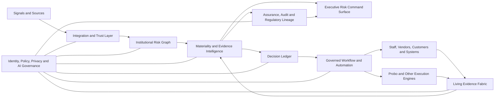
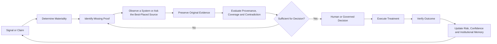

# ClearSight GRC

> **The AI-native risk operating system for regulated institutions.**  
> Detect earlier. Ask less. Decide clearly. Prove continuously.

ClearSight is being designed for banks and other highly regulated institutions whose Chief Risk Officers, Chief Compliance Officers, Chief Information Security Officers, business owners, assurance teams, and boards need to understand and handle material risk without spending their day operating a traditional GRC system.

The product goal is simple:

> **Enable the institution to make the safest defensible decision with the least reasonable human effort, then prove that the decision and resulting action actually worked.**

ClearSight is not another passive register of risks, controls, policies, evidence files, and overdue tasks. It is intended to become the institution’s **risk operating layer**: a continuously updated model of risk, obligations, controls, evidence, decisions, actions, outcomes, and institutional context.

## Current status

This repository is currently at the **product-definition and architecture stage**. Capabilities described here are product requirements and intended behavior, not claims of completed implementation.

The foundational documents are:

- [`AGENTS.md`](AGENTS.md) — mandatory implementation and non-regression rules.
- [`docs/implementation-plan.md`](docs/implementation-plan.md) — phased implementation plan with tasks, dependencies, acceptance gates, and deliverables.
- [`docs/product/differentiation.md`](docs/product/differentiation.md) — the product moat and boundaries that must not be diluted.
- [`docs/product/experience-principles.md`](docs/product/experience-principles.md) — the visual, interaction, and information-design standard.
- [`docs/architecture/living-evidence-fabric.md`](docs/architecture/living-evidence-fabric.md) — claim-centric evidence capture, validation, and reconciliation.
- [`docs/architecture/risk-graph-and-decision-engine.md`](docs/architecture/risk-graph-and-decision-engine.md) — the institutional graph, materiality engine, and decision ledger.
- [`docs/architecture/governed-ai-operators.md`](docs/architecture/governed-ai-operators.md) — constrained AI operators, human authority, model governance, and auditability.
- [`docs/quality/acceptance-tests.md`](docs/quality/acceptance-tests.md) — product, security, visual, and end-to-end acceptance requirements.

---

# Product thesis

## Risk is a living network, not a row in a register

A material banking risk is rarely isolated.

A payment-service disruption may involve a critical business service, a third-party processor, a production change, an expired failover test, a concentration dependency, customer-impact thresholds, regulatory notification obligations, open audit findings, and remediation work competing for the same resources.

Traditional systems often store those facts in separate modules and ask people to reconstruct the real situation manually. ClearSight instead treats the institution as a connected, time-aware **risk and evidence graph**.

## Evidence should be assembled around claims

A control is not effective because a control owner selected “effective.” A remediation is not complete because a task was marked “done.” A regulatory requirement is not satisfied because a document was uploaded.

ClearSight treats assurance as a relationship between:

- a precise claim;
- the risk, obligation, policy, control, or action the claim concerns;
- the original evidence supporting or contradicting it;
- the evidence source and provenance;
- the evidence’s effective period, freshness, scope, and coverage;
- the conclusion drawn from it;
- the confidence and assumptions behind that conclusion;
- and the person or governed operator accountable for the judgment.

## AI should eliminate assembly work, not accountability

AI may collect, classify, extract, map, reconcile, summarize, draft, prioritize, simulate, and recommend. It must not silently accept material risk, alter risk appetite, close significant findings, suppress reportable incidents, expose a protected reporter, or make an untraceable representation to a regulator.

The system must route material judgment to the appropriate human authority and retain the full evidence and reasoning trail.

## The executive surface should be a decision surface

A CRO, CCO, or CISO should normally see only:

- what materially changed;
- why it matters now;
- what is known and uncertain;
- which evidence is weak or contradictory;
- what decision is required;
- what can safely be delegated or automated;
- and how the institution will verify that the chosen response worked.

Underlying complexity remains available through progressive disclosure, but it must not dominate the default experience.

---

# The ClearSight operating model

ClearSight is organized around seven connected capabilities.

## 1. Signal Mesh

The **Signal Mesh** ingests structured and unstructured signals from the institution and its environment, including:

- risk and control assessments;
- operational incidents, losses, and near misses;
- customer complaints and external reports;
- confidential staff and whistleblower reports;
- vulnerability, identity, cloud, resilience, and service telemetry;
- vendor performance and concentration data;
- audit findings and assurance results;
- policy and regulatory changes;
- workflow, ticketing, HR, finance, procurement, and core-system events;
- model and AI-system monitoring;
- and targeted human observations.

Signals remain distinguishable from verified facts. Each signal carries source, time, scope, sensitivity, and trust metadata.

## 2. Institutional Risk Graph

The **Institutional Risk Graph** connects the organization’s objectives, legal entities, products, services, customers, processes, locations, people, systems, data, models, vendors, obligations, policies, controls, risks, incidents, evidence, decisions, and actions.

It allows the system to answer questions such as:

- Which critical services depend on this vendor and its fourth parties?
- Which controls support this regulatory statement, and what current evidence proves them?
- Which accepted risks are now outside appetite because the business context changed?
- Which customer-impact incidents share the same control weakness?
- Which proposed investment reduces the most material exposure across multiple risks?

The graph is temporal and versioned. The institution must be able to reconstruct both **what was true at a given time** and **what the institution knew at that time**.

## 3. Materiality Compiler

The **Materiality Compiler** converts raw changes into decision-relevant risk movement.

It evaluates each signal against:

- risk appetite and limits;
- affected customers, services, jurisdictions, and legal entities;
- financial and non-financial impact;
- risk velocity and time sensitivity;
- dependency concentration and propagation paths;
- evidence strength and contradiction;
- control importance and failure mode;
- regulatory and contractual deadlines;
- prior incidents and loss history;
- and executive or committee authority thresholds.

The result is not another alert stream. The result is a deliberately small set of material changes, each tied to an owner, decision, or verification need.

## 4. Living Evidence Fabric

The **Living Evidence Fabric** is ClearSight’s defining capability.

It continuously determines:

- what claim needs proof;
- what evidence already exists;
- what evidence is missing, stale, incomplete, or contradictory;
- who or what is best placed to provide it;
- the smallest useful question to ask;
- how to capture the response in the recipient’s normal workflow;
- and whether the resulting evidence is sufficient for the intended decision.

Instead of sending a broad questionnaire such as:

> Upload evidence for control AC-07.4.

ClearSight should be able to ask:

> The privileged-access review for Treasury Operations is due. We already found the current user list and prior approvals. Please confirm whether these four users still require access and attach approval for either exception.

The system pre-fills everything it already knows and asks only for unresolved facts.

Evidence may come from:

- system integrations and telemetry;
- secure web or mobile forms;
- email and enterprise messaging;
- camera, screenshot, document, voice, and video capture;
- staff attestations;
- vendor portals;
- customer reporting channels;
- whistleblower submissions;
- controlled bulk imports;
- and approved external intelligence.

AI may transcribe, extract, classify, redact, map, compare, and identify contradictions, but the original source remains preserved and accessible.

## 5. Decision Ledger

The **Decision Ledger** records every material risk decision as a durable institutional object, not merely a meeting note.

A decision record includes:

- the risk or obligation in question;
- the material change and business context;
- evidence used and evidence excluded;
- uncertainties and competing interpretations;
- available options;
- projected risk movement, cost, dependencies, and time-to-effect for each option;
- selected action and rationale;
- approval authority and segregation-of-duties checks;
- dissent, overrides, and conditions;
- review and expiry dates;
- and the verification plan.

This gives the institution a defensible memory of who knew what, why a decision was made, and whether later outcomes justified it.

## 6. Governed Action and Automation

ClearSight routes approved work to people, systems, and specialized execution engines.

It may integrate with systems such as ITSM, project management, IAM, security orchestration, vendor management, document management, and open-source compliance automation platforms such as Probo.

ClearSight’s responsibility is to:

- determine why the task matters;
- bind it to the affected risk, obligation, service, control, and decision;
- ensure that the actor is authorized;
- preserve context and expected outcome;
- reconcile returned evidence;
- and verify whether execution changed the risk.

Execution adapters must remain replaceable. ClearSight must not become dependent on one model vendor, compliance engine, cloud provider, or workflow platform.

## 7. Assurance Loop

The **Assurance Loop** verifies that actions and controls remain effective.

The loop is:

> **Sense → Explain → Decide → Act → Prove → Learn**

A task completion is an activity signal, not proof of risk reduction. ClearSight closes a material issue only after defined outcome evidence is collected and accepted.

If later evidence contradicts the conclusion, the system reopens or reclassifies the issue, updates the risk state, and preserves the original decision history.

---

# What makes ClearSight different

## Dynamic human evidence, not static questionnaires

ClearSight treats employees, vendors, customers, and confidential reporters as part of a governed evidence network. It asks context-aware micro-questions instead of repeatedly sending broad assessments.

## Customer and whistleblower intelligence are native risk signals

Customer complaints and protected reports are not isolated case-management records. They can reveal conduct, operational, fraud, privacy, culture, resilience, and control failures before formal monitoring does.

ClearSight supports anonymous or identified reporting, secure two-way communication, strict need-to-know access, conflict-aware routing, protected identity separation, and complete chain-of-custody controls.

## Closure requires outcome verification

A remediation item cannot be treated as effective merely because its owner completed a checklist. The intended risk outcome, measurement method, observation period, and acceptance authority must be defined before closure.

## Materiality before volume

The system is optimized to reduce executive noise. Thousands of low-level events may be summarized into one material decision card when they represent the same causal exposure.

## Every material AI action is governed

Each AI operator is identity-bound, purpose-bound, scope-constrained, policy-checked, model-versioned, confidence-aware, and audit-emitting. The human authority threshold depends on the reversibility and materiality of the action.

## Institutional memory is a product capability

The graph, evidence fabric, and decision ledger preserve how risk understanding evolved. ClearSight should make it possible to reconstruct a past board statement, risk acceptance, control conclusion, or regulatory response years later.

## Enterprise depth without enterprise friction

ClearSight takes the integrated, connected view expected from major enterprise risk platforms, the low-bloat usability expected from modern GRC products, and the automation possibilities of open compliance engines—but centers the product on bank-specific decision intelligence, dynamic evidence, protected reporting, and verified risk handling.

Detailed positioning is defined in [`docs/product/differentiation.md`](docs/product/differentiation.md).

---

# AI-first executive experience

The primary ClearSight interface is an **executive risk brief and decision queue**, not a conventional dashboard.

## Today

The default view answers:

1. What materially changed?
2. Which risks are outside appetite or approaching a limit?
3. What is the strength of the evidence?
4. Which decisions require my authority?
5. Which actions are delayed, ineffective, or likely to miss a deadline?
6. Which work can be delegated or safely automated?
7. What should the board, regulator, or audit committee know?

The default brief should usually contain only a handful of material items, even when many underlying signals changed.

## Explain

Opening a material item reveals:

- affected objectives, customers, services, systems, vendors, obligations, and entities;
- the causal and dependency path;
- inherent, current, residual, and target risk;
- risk velocity and time-to-impact;
- evidence coverage, freshness, and contradiction;
- source lineage;
- historical decisions and outcomes;
- and the assumptions used by the system.

## Act

A decision card provides proportionate options, including:

- mitigate;
- investigate;
- transfer or share;
- temporarily accept;
- permanently accept within authority;
- escalate;
- stop or avoid the activity;
- change a control;
- trigger an incident or regulatory workflow;
- delegate evidence collection;
- or authorize governed automation.

Each option shows expected risk movement, cost, owner, dependencies, deadline, reversibility, and required approval.

## Prove

Every approved action has a verification contract defining:

- the expected outcome;
- the evidence required;
- the source of that evidence;
- the observation period;
- success and failure thresholds;
- who accepts the result;
- and what happens if the outcome is not achieved.

## Natural-language investigation

Authorized users should be able to ask:

- “What moved operational risk this week?”
- “Why did payments resilience decline?”
- “Show every high-risk vendor supporting a critical service without a tested exit plan.”
- “Which accepted risks are now outside appetite?”
- “What evidence supports our statement that privileged access is reviewed monthly?”
- “Which remediation plans are unlikely to finish before the next committee meeting?”
- “Prepare a board explanation without technical terminology.”

Every answer must disclose source lineage, time scope, assumptions, confidence, contradictory evidence, and links to the underlying records.

---

# Core capability domains

ClearSight is intended to support a connected set of bank risk and governance domains.

## Enterprise and operational risk

- Risk taxonomy and scenario definition
- Inherent, current, residual, and target risk
- Qualitative, quantitative, and hybrid assessment methods
- Risk appetite, limits, triggers, and breach management
- Risk velocity, persistence, detectability, controllability, and concentration
- Emerging-risk identification
- Portfolio aggregation with uncertainty ranges
- Treatment decisions and acceptance history
- Event-driven reassessment

## Compliance and regulatory change

- Regulatory-source ingestion
- Applicability by jurisdiction, entity, product, and activity
- Obligation extraction and normalization
- Obligation-to-policy, control, process, system, and evidence mapping
- Change comparison and effective-date tracking
- Gap identification and implementation planning
- Regulatory notification and examination workflows
- Source-to-obligation-to-control-to-evidence lineage

## Cyber and technology risk

- Asset, identity, data, threat, vulnerability, and control relationships
- Continuous control signals
- Security exception and compensating-control management
- Material cyber-incident governance
- Cloud, application, infrastructure, and change risk
- Data residency and privacy risk
- Security investment prioritization
- CISO and board reporting

ClearSight integrates with specialist platforms rather than replacing SIEM, SOAR, EDR, IAM, vulnerability-management, or observability systems.

## Third-party and concentration risk

- Third- and fourth-party dependency mapping
- Due diligence and onboarding
- Contract, SLA, insurance, and obligation tracking
- Continuous performance and risk signals
- Vendor evidence exchange
- Concentration, substitutability, and stressed-exit analysis
- Exit plans and remediation
- Risk-based periodic review

## Operational resilience

- Critical business-service mapping
- People, process, technology, facility, data, and third-party dependencies
- Impact tolerances
- Business impact analysis
- Scenario simulation and testing
- Continuity, disaster recovery, and crisis plans
- Incident timelines and recovery evidence
- Lessons learned linked to controls and risk

## Model and AI risk

- Model and AI-system inventory
- Use case, owner, data, vendor, and deployment context
- Criticality and impact classification
- Validation and monitoring requirements
- Bias, privacy, explainability, security, robustness, and misuse risk
- Human oversight and approval gates
- Model, prompt, policy, and deployment lineage
- AI incidents, exceptions, and regulatory mappings

## Incidents, losses, findings, and remediation

- Incident, near-miss, loss, and customer-impact intake
- Root cause and contributing factors
- Control-failure linkage
- Regulatory notification rules
- Findings, issues, exceptions, and waivers
- Action plans, milestones, dependencies, and resources
- Evidence-based closure and post-closure effectiveness review
- Recurrence analysis and risk recalibration

## Policy, control, assurance, and audit

- Policy lifecycle and ownership
- Control objectives and implementations
- Design and operating-effectiveness testing
- Automated and manual evidence
- Test plans and sampling
- Control rationalization and duplicate detection
- Audit planning and information requests
- Secure evidence rooms
- Findings and management responses
- Immutable examiner-ready export packages

---

# Bank-first governance model

ClearSight supports the three lines model without creating three incompatible versions of reality.

## First line

Business and technology owners receive context-specific requests, prefilled information, clear ownership, and visible business relevance. They should not need to understand every framework or control identifier to provide valid evidence or handle a risk.

## Second line

Risk, compliance, security, privacy, resilience, conduct, and model-risk teams define policy and appetite, challenge conclusions, evaluate evidence, monitor aggregate exposure, orchestrate remediation, and escalate material decisions.

## Third line

Internal audit retains independence while using traceable source data. Audit creates separate assurance conclusions, samples original evidence, inspects overrides and AI actions, and maintains an independent audit trail.

## Executive and board governance

Executives and committees receive decision-oriented briefs, appetite breaches, concentrated dependencies, scenario outlooks, evidence-quality warnings, and clear management actions. Committee packs are generated from governed live data, with each statement traceable to source evidence and decisions.

---

# Confidential reporting and customer-sourced intelligence

## Whistleblower portal

The protected reporting experience must support:

- anonymous or identified reporting;
- multilingual intake;
- secure case tokens for anonymous two-way communication;
- attachments and voice evidence;
- identity storage separated from case content;
- conflict-of-interest-aware routing;
- anti-retaliation process checkpoints;
- legal privilege and sensitivity markers;
- jurisdiction-specific retention and disclosure rules;
- duplicate and related-case detection;
- strict need-to-know access;
- and complete audit history.

AI may assist with translation, triage, summarization, classification, and urgent routing. It must not infer credibility from writing style, emotion, demographics, accent, or other unreliable proxies.

## Customer signal intake

Customer reports can be linked to products, branches, channels, services, incidents, vendors, and controls. ClearSight distinguishes allegation from verified fact, detects patterns and concentration, routes urgent matters, and measures whether remediation reduced recurrence.

ClearSight is not intended to replace a full complaints-management, fraud-monitoring, or case-management platform. It provides the cross-domain risk and evidence layer around those systems.

---

# Governed AI operators

ClearSight exposes specialized, constrained operators rather than one unconstrained assistant.

| Operator | Primary responsibility |
|---|---|
| Risk Intelligence Operator | Detects material changes and emerging risk relationships |
| Evidence Operator | Collects, classifies, validates, reconciles, and refreshes evidence |
| Regulatory Operator | Tracks changes, proposes obligations, and maps institutional impact |
| Control Operator | Evaluates control coverage and proposes tests or remediation |
| Resilience Operator | Maps dependencies and evaluates stressed scenarios |
| Third-Party Operator | Coordinates due diligence, monitoring, and vendor evidence |
| Remediation Operator | Builds feasible plans, dependencies, and verification contracts |
| Assurance Operator | Challenges evidence sufficiency and prepares audit lineage |
| Executive Briefing Operator | Produces concise, role-specific, traceable decision briefs |

Each operator must have:

- a verified service identity;
- tenant, legal-entity, and data scope;
- an explicit purpose;
- permitted tools and action classes;
- model and version lineage;
- input and source references;
- confidence and justification;
- policy checks;
- approval requirements;
- execution result;
- and an immutable audit event.

Detailed requirements are defined in [`docs/architecture/governed-ai-operators.md`](docs/architecture/governed-ai-operators.md).

---

# Probo and automation-engine compatibility

ClearSight should not rebuild every commodity compliance workflow.

Probo or another execution engine may manage framework controls, compliance measures, evidence collection, policies, vendors, audits, tasks, and related automation. ClearSight remains responsible for institutional context, risk materiality, protected evidence, decision authority, cross-domain relationships, and outcome verification.

```text
Probo or another execution engine
    └── performs approved compliance tasks and technical evidence collection

ClearSight
    ├── determines why the task matters
    ├── connects it to risk, obligations, services, controls, and decisions
    ├── governs which person or operator may perform it
    ├── reconciles returned automated and human evidence
    ├── routes material exceptions
    └── verifies whether the task actually changed risk
```

The adapter must be idempotent, version-aware, permission-bound, observable, and replaceable.

---

# Product navigation

The primary navigation reflects user intent rather than conventional module boundaries.

## Today

- Executive brief
- Decisions required
- Material changes
- Appetite breaches
- Evidence gaps
- Escalations
- Upcoming obligations

## Explore

- Institutional graph
- Services and dependencies
- Risk portfolio
- Scenarios
- Obligations and controls
- Evidence and assurance
- Incidents and losses

## Act

- Decisions
- Actions and remediation
- Evidence requests
- Reviews and approvals
- Investigations
- Exceptions and acceptances

## Prove

- Verification contracts
- Control tests
- Evidence rooms
- Audit and examination
- Regulatory lineage
- Decision history

## Govern

- Risk appetite
- Policies and taxonomies
- AI and automation permissions
- Data access and residency
- Retention and legal hold
- Administration

Role-specific views may reduce this further.

---

# Design taste

ClearSight should feel **calm, precise, premium, and institutional**.

“Futuristic” does not mean decorative science fiction. It means the interface understands context, removes repetitive work, visualizes complex relationships clearly, and makes high-stakes decisions easier to comprehend.

## Visual principles

- Low visual noise and strong hierarchy
- Progressive disclosure instead of dense default screens
- Restrained glass, depth, and glow used to communicate hierarchy or intelligence
- Relationship-first visualizations instead of heat-map dependence
- Semantic color rather than decorative color
- Dark and light themes with equivalent clarity
- Keyboard-first desktop operation and excellent mobile evidence capture
- Subtle, optional motion that explains change or propagation
- Accessible contrast, focus, reduced-motion behavior, and screen-reader semantics
- Stable layouts that do not shift as intelligence arrives

A possible semantic color model:

- **Cyan:** intelligence, context, or newly discovered relationships
- **Violet:** governance, control, or approved automation
- **Coral/red:** material exposure, gap, or breach
- **Amber:** uncertainty, pending verification, or approaching threshold
- **Green:** verified outcome—not merely self-attested completion
- **Neutral:** informational or unassessed state

Green must be earned by evidence.

Every material risk object must answer seven questions without requiring a separate report:

1. What is the risk?
2. Why does it matter now?
3. What changed?
4. What evidence supports the conclusion?
5. Who owns the decision?
6. What should happen next?
7. How will the institution know the action worked?

The complete visual and interaction contract is in [`docs/product/experience-principles.md`](docs/product/experience-principles.md).

---

# High-level architecture



## Evidence and decision loop



---

# Technical principles

## Start coherent, not distributed

The first implementation should favor a well-structured modular core with strict domain boundaries, transactional integrity, an outbox/event model, and replaceable adapters. Premature microservices are prohibited unless justified by measured scaling, isolation, deployment, or regulatory requirements.

## API-first and event-aware

- Every major object and workflow has a governed API.
- Material state changes emit durable events.
- Integrations are idempotent and observable.
- Long-running workflows are resumable.
- Bulk operations cannot bypass object-level authorization.
- Derived views can be rebuilt from authoritative records and events.

## Temporal and immutable where it matters

- Evidence versions are immutable.
- Material decisions are append-only with superseding records.
- Audit events are immutable.
- Risk state supports point-in-time reconstruction.
- Source facts are separated from derived conclusions.
- Corrections preserve the prior record and reason.

## Security and privacy

- Zero-trust service design
- SSO, MFA, SCIM, and delegated administration
- RBAC combined with attribute- and relationship-based access
- Field-, evidence-, and relationship-level authorization
- Separation of duties and conflict-aware routing
- Break-glass workflows
- Encryption in transit and at rest
- Customer-managed keys where required
- Tenant and legal-entity isolation
- Data-loss prevention and secure export controls
- Protected reporter identity vault
- Purpose limitation, minimization, retention, legal hold, redaction, and pseudonymization
- Comprehensive security telemetry

## Model independence and graceful degradation

The AI layer must support approved commercial models, private models, self-hosted models, specialist models, deterministic rules, and non-AI analytical engines.

The core risk record, evidence chain, decisions, approvals, and manual workflows must remain usable when an external model provider is unavailable.

## Deployment flexibility

The target architecture should support:

- multi-tenant SaaS;
- dedicated cloud tenancy;
- private cloud;
- on-premises deployment;
- hybrid data planes;
- regional data residency;
- customer-managed encryption keys;
- and controlled model routing.

Implementation details and decision gates are defined in [`docs/implementation-plan.md`](docs/implementation-plan.md).

---

# Initial product wedge

ClearSight should not begin by recreating every mature GRC module.

The first bank-focused release must prove five connected capabilities:

1. **Executive Risk Brief** — a minimal view of material change, evidence weakness, and decisions.
2. **Institutional Risk and Control Graph** — services, systems, vendors, obligations, controls, risks, evidence, and actions in one coherent model.
3. **Dynamic Evidence Requests** — context-aware, low-effort evidence capture from staff and systems.
4. **Decision Ledger with Verified Remediation** — risk treatment that closes only after outcome evidence.
5. **Confidential Reporting Portal** — secure whistleblower and external risk-signal intake with protected two-way communication.

A narrow, deeply integrated product is preferable to a broad set of disconnected forms.

---

# Success measures

ClearSight is judged by institutional outcomes, not by the number of records stored.

## Executive outcomes

- Time from material signal to accountable decision
- Number and age of unresolved material decisions
- Percentage of executive brief items with sufficient evidence
- Accuracy and usefulness of projected treatment impact
- Time required to prepare committee and board materials

## Risk and compliance outcomes

- Time from regulatory publication to applicability decision
- Time from obligation to implemented and evidenced control
- Percentage of material controls with current evidence
- Unsupported, stale, or contradictory control claims
- Appetite-breach duration
- Overdue remediation exposure
- Repeat incidents and repeat findings
- Risk-acceptance revalidation quality

## Organizational-effort outcomes

- Staff time per accepted evidence item
- Number of questions required per evidence request
- Duplicate evidence requests avoided
- Manual evidence-handling hours eliminated
- Percentage of requests answered in the recipient’s normal work channel
- Low-value alerts suppressed by materiality logic

## Trust outcomes

- Percentage of material AI outputs with complete lineage
- Human override rate and override-reason quality
- Unauthorized or out-of-scope AI action attempts
- Evidence-chain integrity
- Time to reconstruct a past decision
- Protected-report access violations
- Auditor and regulator evidence-retrieval time

---

# Non-goals

ClearSight is not intended to be:

- a generic document-management system;
- a spreadsheet replacement with nicer cards;
- a single-framework certification checklist;
- a security-event platform;
- a fraud or AML transaction-monitoring engine;
- a core banking platform;
- an autonomous risk officer;
- an opaque AI scoring product;
- or a set of disconnected GRC modules.

It integrates with specialist systems and provides the governed risk, evidence, decision, and assurance layer across them.

---

# Product invariants

1. **Materiality before volume**
2. **Evidence before confidence**
3. **Relationships before forms**
4. **Decisions before dashboards**
5. **Verification before closure**
6. **Automation before reminders**
7. **Human authority for material judgment**
8. **Progressive disclosure over interface density**
9. **Open integration over platform captivity**
10. **Institutional memory over periodic reporting**
11. **Protected reporting without credibility profiling**
12. **No AI action without identity, scope, lineage, and policy**

These invariants are mandatory. See [`AGENTS.md`](AGENTS.md).

---

# Closing vision

A mature ClearSight deployment should allow a bank executive to ask:

> “What could materially harm the institution, what changed since yesterday, what do we actually know, what must we decide, and did our response work?”

The answer should take seconds to understand, remain defensible years later, and require the minimum reasonable effort from everyone involved.

**That is the standard for an AI-native risk operating system.**