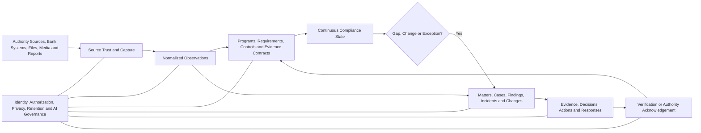

# ClearSight GRC

> **The direct, AI-native continuous compliance and risk operating system for banks.**  
> Know what applies. Keep proof current. Handle what changed. Respond with confidence.

ClearSight is being designed for banks whose compliance, risk, security, privacy, resilience, audit, legal, business, and executive teams need a simpler and more useful alternative to form-heavy GRC suites, recurring questionnaires, fragmented spreadsheets, and manually assembled reports.

The product goal is:

> **Help every stakeholder understand what the institution must do, how it is being satisfied, what evidence proves it, what has changed or become uncertain, who must act, and whether the required outcome was achieved—with the minimum reasonable human effort.**

ClearSight remains a comprehensive modern GRC platform. Users do not operate its internal architecture. They work through familiar **Programs**, **Matters**, focused evidence requests, decisions, actions, and outcomes.

A DPO should be able to run the institution’s NDPA programme without rebuilding ROPA, DPIA, breach, vendor, consent, and annual filing status from separate workbooks. A channel owner should see the exact POS or ATM exposure requiring action. A compliance officer should turn a new CBN circular into approved obligations, controls, owners, and evidence requirements. An authorized legal or AML team should handle an EFCC-style request through a protected, traceable case instead of email and ad hoc spreadsheets.

## Five-minute usability standard

ClearSight should do the assembly work before asking a person to act.

For routine, authorized, well-scoped work, the user should normally be able to complete the task in **less than five minutes of active effort** and through only a few clear steps.

ClearSight achieves this by:

- pulling scope, assets, applications, branches, vendors, owners, customers, accounts, projects, controls, policies, and prior evidence from approved bank inventories and source systems;
- prefilling known information with visible provenance and freshness;
- asking only for missing, stale, contradictory, or insufficient facts;
- reusing approved spreadsheet mappings, templates, and prior submissions;
- generating grounded AI recommendations, mappings, summaries, evidence requests, remediation options, and verification criteria;
- presenting one obvious next action;
- preserving context and progress across steps;
- supporting safe save and resume;
- focusing reviewers on exceptions rather than forcing full re-review.

Some activities—legal interpretation, investigations, material risk acceptance, high-impact authority responses, or observation periods—cannot responsibly finish in five minutes. In those cases, ClearSight must still enable the user to reach a **clear, saved, correctly routed next state within five minutes**.

Ease of use never bypasses evidence, authority, segregation of duties, legal review, privacy, or verification.

See [`docs/product/ease-of-use-standard.md`](docs/product/ease-of-use-standard.md).

## Current status

This repository is at the **product-definition and architecture stage**. Capabilities described here are product requirements and intended behavior, not claims of completed implementation.

Start with:

- [`docs/product/continuous-compliance-operating-model.md`](docs/product/continuous-compliance-operating-model.md) — Programs and Matters replacing disconnected registers.
- [`docs/product/ease-of-use-standard.md`](docs/product/ease-of-use-standard.md) — mandatory workflow-efficiency and five-minute usability rules.
- [`docs/product/operating-model.md`](docs/product/operating-model.md) — canonical scopes, observations, claims, evidence, decisions, and verification.
- [`docs/product/regulatory-and-enforcement-intelligence.md`](docs/product/regulatory-and-enforcement-intelligence.md) — regulatory change, supervisory findings, and protected authority cases.
- [`docs/product/experience-principles.md`](docs/product/experience-principles.md) — visual and interaction standard.
- [`docs/implementation-plan.md`](docs/implementation-plan.md) — phased delivery plan.
- [`docs/quality/acceptance-tests.md`](docs/quality/acceptance-tests.md) — product, usability, security, evidence, visual, and end-to-end requirements.
- [`AGENTS.md`](AGENTS.md) — mandatory implementation and non-regression rules.

---

# Why ClearSight

Most banks do not lack registers. They have too many of them.

The same institutional reality is often copied into:

- compliance registers;
- IT and operational risk registers;
- exception trackers;
- RCSA workbooks;
- KRI submissions;
- BIA registers;
- vendor assessments;
- privacy checklists;
- policy and certification trackers;
- incident and loss logs;
- annual workplans;
- regulatory response files;
- management dashboards.

Ownership is transferred through comments and email. Evidence is repeatedly requested. Reports are manually assembled. A completed task can appear “closed” even when the intended result has not been observed.

ClearSight does not merely turn these spreadsheets into web forms.

It creates one governed operating layer in which:

```text
one source is captured once
→ one requirement, control, asset, vendor, event, case, action, or decision is maintained once
→ many authorized views are generated from the same records
```

---

# The two things users operate

## 1. Programs — continuing obligations

A **Program** is a stable, long-lived body of requirements, controls, evidence, reviews, exceptions, and reporting obligations.

Examples:

- NDPA and NDPC compliance;
- AML/CFT;
- CBN cybersecurity and technology risk;
- PCI DSS;
- ISO 27001 and ISO 22301;
- operational resilience;
- third-party assurance;
- RCSA;
- policy lifecycle;
- regulatory returns;
- annual IT risk and control reviews.

A Program answers:

- What requirements apply?
- Which entities, products, services, systems, branches, vendors, customers, data, or processing activities are in scope?
- How is each requirement intended to be satisfied?
- Who owns and independently reviews it?
- What evidence is required?
- Is the evidence current, sufficient, and consistent?
- Which exceptions or gaps are active?
- What filing, review, test, or decision is due next?

A Program page should not expose hundreds of controls as an undifferentiated list. It should show the current position, material gaps, expiring evidence, upcoming obligations, recent changes, and Matters requiring attention.

## 2. Matters — work created by change or exception

A **Matter** is a bounded occurrence requiring assessment, evidence, decision, action, response, or verification.

Matter types include:

- regulatory change;
- supervisory finding;
- enforcement or authority request;
- risk situation;
- control gap;
- audit finding;
- exception or waiver;
- incident;
- operational loss;
- data breach;
- vendor deficiency;
- customer or conduct concern;
- overdue obligation;
- failed verification;
- evidence contradiction;
- KRI threshold breach.

A Matter answers:

- What happened or changed?
- Why does it matter?
- What is affected?
- What is known, missing, stale, or contradictory?
- Which Program, requirement, control, service, customer, account, asset, or vendor is involved?
- Who must decide or respond?
- What actions are underway?
- How will closure or response be verified?

A Matter workspace keeps summary, evidence, decisions, actions, response, outcome, and history together so users do not navigate separate module homepages.

---

# One compliance chain

Every material compliance position should be traceable through one chain:

```text
Authority Source or Standard
→ Requirement
→ Applicability
→ Institutional Requirement
→ Control Objective
→ Control Implementation
→ Evidence Contract
→ Current Observations
→ Compliance State
→ Matter, Exception, or Assurance Conclusion
```

## Authority source

The original law, circular, regulation, guideline, standard, licence condition, contract, court instrument, or approved internal interpretation.

A manually authored spreadsheet row is not automatically an authoritative regulatory source. It is a working record that must be reconciled to the original source before becoming an approved obligation.

## Requirement and applicability

A Requirement describes what an actor must, must not, may, or is expected to do.

Applicability determines where it applies—for example by legal entity, licence, jurisdiction, product, channel, processing activity, customer population, vendor relationship, system, threshold, or effective period.

AI may propose interpretation and applicability. Authorized compliance or legal reviewers approve material conclusions.

## Control objective and implementation

A control objective defines the outcome that must be achieved.

A control implementation is the actual process, policy, system rule, approval gate, review, monitoring mechanism, or operating practice used in a defined scope.

One objective can have different implementations across legal entities, channels, systems, branches, or vendors.

## Evidence contract

An Evidence Contract defines what proves the requirement and control are satisfied:

- exact claims;
- required population and period;
- acceptable sources;
- source authority and limitations;
- freshness;
- coverage;
- independence;
- contradiction rules;
- reviewer authority;
- refresh schedule or trigger;
- escalation and failure behavior.

## Compliance state

ClearSight keeps separate dimensions visible:

- interpretation;
- applicability;
- control design;
- implementation;
- evidence sufficiency;
- operating effectiveness;
- exceptions;
- assurance;
- deadline or filing status;
- source and data quality.

The product may show a concise state such as **current**, **at risk**, **gap identified**, **evidence insufficient**, **implementation pending**, **overdue**, **under review**, **not applicable**, or **unknown**. It must not hide the underlying dimensions behind an unexplained percentage.

---

# Continuous compliance, not periodic reconstruction

Continuous compliance does not mean ClearSight autonomously guarantees legal compliance.

It means the institution continuously maintains an evidence-backed and reviewable position instead of rebuilding that position only before an audit, certification, committee meeting, or regulatory filing.

A Program responds to four kinds of trigger.

## Calendar triggers

Annual filings, monthly returns, quarterly reports, periodic access reviews, policy reviews, certificate expiry, DR tests, vendor reassessments, and scheduled assurance work.

## Change triggers

New products, projects, systems, vendors, branches, processing activities, data uses, jurisdictions, regulations, policies, owners, or customer populations.

## Event triggers

Incidents, breaches, losses, complaints, control failures, KRI threshold breaches, authority requests, findings, or failed verification.

## Evidence triggers

Stale evidence, changed populations, contradictory sources, degraded integrations, failed tests, or revoked certificates.

The system searches current evidence first and contacts people only when human knowledge or action remains necessary.

---

# NDPA as a continuously maintained Program

An NDPA Program may contain:

- registration and classification;
- DPO governance;
- ROPA;
- lawful basis and consent;
- privacy notices;
- DPIA;
- retention and deletion;
- data-subject rights;
- breach management;
- processor and vendor governance;
- cross-border transfer;
- software and cookie obligations;
- annual compliance audit and filing.

## ROPA

ClearSight preloads known applications, vendors, projects, systems, departments, data stores, and processing relationships from approved sources.

It asks owners only for unresolved purpose, lawful basis, categories, recipients, retention, transfer, or accountability facts. A material change reopens only affected processing activities.

## DPIA

A new project, product, vendor, AI system, sensitive-data use, or process change triggers a prefilled privacy screening. The DPO reviews the generated recommendation, determines whether a full DPIA is required, assigns remediation, and records approval before go-live.

## Breach management

A suspected breach becomes a timed Matter containing awareness time, affected systems and data, data-subject population, reportability decision, authority notification, customer communication, remediation, and verification.

## Annual filing

The evidence package is assembled throughout the year from approved Program records. The filing process becomes final review, exception handling, approval, submission, and acknowledgement—not an annual search through email and folders.

---

# Regulatory and external-authority workflows

## Regulatory change

```text
Official publication
→ exact provisions
→ proposed obligations
→ interpretation and applicability review
→ affected Programs, controls, systems, vendors, and owners
→ implementation Matters
→ evidence and testing
→ continuing compliance state
```

AI may extract provisions, compare versions, suggest applicability questions, map controls, and draft implementation recommendations. Humans approve material legal interpretation and external representation.

## Supervisory finding

A supervisory finding creates a governed Matter with management response, remediation commitments, milestones, evidence, authority communication, and effectiveness verification.

## Enforcement or information request

An EFCC-style or other authority request creates a protected Authority Request Matter containing:

- verified source and legal instrument;
- subjects, accounts, transactions, devices, merchants, records, and period;
- legal and disclosure review;
- KYC, address, records, AML, fraud, branch, or technology tasks;
- governed response package;
- signatory, transmission, and acknowledgement;
- retention and legal hold.

An authority request does not by itself establish guilt, justify every account action, or determine suspicious-reporting obligations. Those remain governed human decisions.

---

# How ClearSight replaces legacy workflows

| Legacy artefact | ClearSight representation |
|---|---|
| Compliance register | Program Requirements view |
| Risk register | Risk Matters and portfolio view |
| Exception register | Exception Matters |
| Annual workplan | Scheduled Review Activities |
| RCSA workbook | Program review workflow and generated Matters |
| KRI workbook | Derived indicators with source drill-down |
| BIA register | Shared service and dependency context |
| Vendor register | Third-party profile, evidence, and Matters |
| Loss register | Loss Events linked to incidents, controls, and recovery |
| Policy tracker | Policy lifecycle linked to Requirements |
| Regulatory response folder | Authority Matter and Response Package |
| Management dashboard | Derived, role-specific live view |

Spreadsheets remain supported import, export, and transition formats. They do not remain separate systems of truth.

---

# Flexible source and evidence capture

ClearSight must be useful before a bank completes a large integration programme.

## Existing inventories and source systems

Approved inventories should supply workflow scope and controlled values:

- applications and systems from CMDB or enterprise architecture;
- assets from asset management;
- branches and organizations from directories;
- owners and employees from HR;
- vendors and contracts from procurement;
- merchants and POS terminals from acquiring systems;
- ATMs from channel inventory;
- customers and accounts from approved core systems;
- projects and changes from ITSM, Jira, or Azure DevOps;
- processing activities from ROPA;
- dependencies from BIA;
- policies, evidence, and certificates from document repositories.

## Progressive integration

- **Level 0:** contextual forms, controlled lists, photos, spreadsheets, and documents.
- **Level 1:** recurring managed files, SFTP, exports, and scheduled imports.
- **Level 2:** APIs for IAM, HR, ITSM, assets, vendors, documents, complaints, and incidents.
- **Level 3:** events and telemetry from switches, services, identity, settlement, security, and configuration systems.

Every level produces the same governed observations and provenance.

## Dynamic capture

A photograph, spreadsheet row, form response, dropdown selection, database record, API event, telemetry value, customer report, vendor submission, or staff attestation can become a traceable Observation.

ClearSight distinguishes explicit source values, AI-extracted values, inferred candidates, user-confirmed values, and approved conclusions.

---

# Governed AI assistance

AI should remove blank-page work and repetitive assembly.

Approved capabilities may:

- interpret documents, spreadsheets, media, messages, and narratives;
- extract regulatory requirements and case directives;
- propose source and entity mappings;
- reconcile identifiers and highlight contradictions;
- draft evidence requests;
- recommend controls, owners, actions, and verification criteria;
- prepare Program and Matter summaries;
- generate first drafts of policies, implementation plans, and response-package indexes;
- identify missing proof;
- prioritize exceptions.

Every recommendation must show sources, scope, assumptions, uncertainty, required authority, and editable structured output.

AI does not become the authority, the evidence itself, or the only method of operation.

---

# Product experience

## Today

A role-specific brief showing only Programs or Matters requiring attention, decisions, expiring evidence, upcoming obligations, failed verification, and material changes.

## Programs

Continuing views for NDPA, AML/CFT, CBN cybersecurity, PCI DSS, ISO, RCSA, resilience, third-party assurance, policies, and other obligations.

## Work

Matters, cases, findings, changes, incidents, exceptions, actions, evidence requests, reviews, and approvals.

## Explore

Requirements, policies, controls, services, assets, branches, customers, accounts, vendors, evidence, incidents, losses, sources, relationships, and history.

## Configure

Institution structure, source registry, Programs, channel and jurisdiction packs, evidence contracts, thresholds, authority, access, retention, and automation policy.

## Respond and Capture

Focused mobile and web experiences for branch staff, control owners, vendors, customers, and protected reporters.

Routine work should normally remain within one coherent workspace and one obvious next action.

---

# Design taste

ClearSight should feel **calm, precise, premium, direct, flexible, and institutional**.

“Futuristic” means the interface understands context, preloads known information, reduces repetitive work, creates useful first drafts, and translates complexity into direct handling paths. It does not mean decorative science fiction.

Principles:

- usability and active-effort budgets are product requirements;
- routine workflows target under five minutes;
- one clear next action per state;
- known information is prefilled;
- review by exception;
- Programs before control walls;
- Matters before module hopping;
- banking language before GRC jargon;
- progressive disclosure rather than dense default screens;
- tables for populations, cards for small attention queues, comparisons for contradictions, timelines for history;
- restrained glass, depth, glow, and semantic color;
- full light/dark, keyboard, screen-reader, mobile, and low-bandwidth support;
- no mandatory chatbot interaction.

Green must be earned by evidence. It must not mean merely uploaded, assigned, submitted, or implemented.

---

# High-level architecture



Initial technical shape:

```text
Modular core
├── authoritative relational store
│   ├── Programs, Requirements, Controls and Compliance State
│   ├── Matters, Cases, Findings, Decisions and Actions
│   ├── Sources, Observations, Evidence Contracts and Conclusions
│   └── Scope, authority, policy, temporal history and audit
├── versioned object storage
├── durable workflow, trigger engine and outbox
├── authorization-aware search and projections
├── rules and policy evaluation
├── governed AI gateway
└── replaceable integration adapters
```

A dedicated graph database, vector database, large microservice estate, or autonomous agent platform is not required for the first release.

---

# Initial product wedge

The first release should prove three connected journeys inside one bank and legal entity:

1. **Continuous NDPA Program** — import existing checklist/ROPA data, define sources and evidence contracts, trigger targeted updates, create DPIA or breach Matters, and prepare an annual filing package.
2. **Regulatory Change Matter** — ingest an official circular, extract exact provisions, approve applicability, propose control changes, assign implementation, and update continuing Program state.
3. **Protected Authority Request Matter** — verify an external request, resolve subjects, route legal/KYC/address/records/AML tasks, prepare a governed response package, and preserve acknowledgement.

A fourth legacy-finding journey should demonstrate import from an existing IT or vendor register, structured ownership, evidence review, action, and verification before closure.

The release must show that ClearSight can reuse bank inventories, prefill workflows, support mixed integration maturity, produce grounded AI recommendations, and keep routine active effort below five minutes without weakening governance.

---

# Success measures

## Human effort and usability

- median and 90th-percentile active completion time;
- routine focused requests completed within five minutes;
- routine approvals completed within two minutes where context is complete;
- screens or workspace transitions per workflow;
- manually entered versus prefilled fields;
- duplicate facts and evidence requests avoided;
- time to resume a complex Matter;
- abandonment, redirect, correction, and rejection rates;
- accessibility and mobile completion rates.

## Continuous compliance

- applicable Requirements with mapped Controls;
- Requirements with current sufficient evidence;
- stale, missing, contradictory, or unsupported claims;
- Matters created automatically from meaningful triggers;
- time from change to approved applicability;
- time to assemble filing or examination packages;
- recurring questionnaire fields eliminated through source reuse.

## Integration and data quality

- time to onboard a usable source;
- observations with complete lineage;
- source freshness and health;
- unresolved identifiers and stale relationships;
- spreadsheet correction and mapping-reuse rate;
- source failures surfaced before decisions.

## Decision, response, and assurance

- time to accountable decision or authority response;
- overdue Matters and commitments;
- verification success, failure, and indeterminate rates;
- reopened Matters;
- point-in-time reconstruction time;
- audit, board, and regulator preparation time.

## AI trust

- grounded-source completeness;
- unsupported assertion rate;
- abstention quality;
- human edit, rejection, and override rate;
- time saved through AI drafts and mappings;
- unauthorized action attempts;
- downstream verification of AI-supported recommendations.

---

# Non-goals

ClearSight is not:

- a generic document-management system;
- a spreadsheet replacement with nicer cards;
- a collection of permanent questionnaires;
- a single-framework checklist;
- a security-event, fraud, AML, or transaction-monitoring engine;
- a core banking platform or payment switch;
- a full complaints or unrestricted investigation platform;
- an autonomous compliance or risk officer;
- an opaque AI scoring product;
- a mandatory graph canvas;
- a chatbot wrapper around GRC records;
- disconnected GRC modules.

It provides the governed Program, Matter, evidence, decision, response, verification, and assurance layer across specialist systems.

---

# Product invariants

1. **Programs for continuing obligations; Matters for change and exception**
2. **Routine active effort under five minutes wherever responsibly possible**
3. **A clear saved next state within five minutes for complex work**
4. **Prefill before asking**
5. **Existing evidence before human requests**
6. **Approved inventories and integrations before manual re-entry**
7. **Grounded AI first drafts before blank-page work**
8. **One clear next action**
9. **Banking language before GRC jargon**
10. **Source authority and data quality before automated trust**
11. **Evidence before confidence**
12. **Decisions before dashboards**
13. **Verification before closure**
14. **Human authority for material judgment and external representation**
15. **Progressive disclosure over interface density**
16. **Open integration over platform captivity**
17. **Institutional memory over periodic reconstruction**
18. **No AI action without identity, purpose, scope, lineage, policy, and audit**

---

# Closing vision

A mature ClearSight deployment should allow a bank stakeholder to ask:

> “What must we do, what is already being satisfied, what proof is current, what changed, what needs my attention, and did our response achieve the required outcome?”

For routine work, the answer and action should require only a few clear steps and less than five minutes of active effort. For complex work, the system should assemble the context, recommend the next governed action, preserve progress, and ensure that no one has to reconstruct the case from scattered registers and email.

**That is the standard for a modern, direct, continuously compliant, bank-first GRC operating system.**